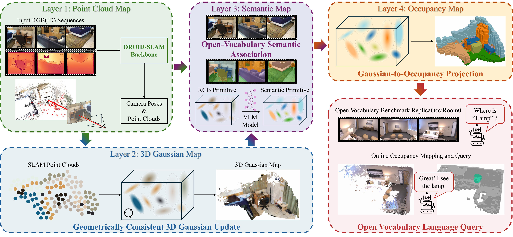

<h1 align="center">FreeOcc: Training-Free Embodied Open-Vocabulary Occupancy Prediction</h1>

<p align="center">
  
</p>

<p align="center"><strong>
    <a href="https://the-masses.github.io/">Zeyu Jiang</a><sup>* 1</sup>,
    <a href="https://scholar.google.com/citations?user=FZ3jPs4AAAAJ&hl=zh-CN">Changqing Zhou</a><sup>* 1</sup>,
    <a href="https://xingxingzuo.github.io/">Xingxing Zuo</a><sup>2</sup>,
    <a href="https://changhao-chen.github.io/">Changhao Chen</a><sup>1 ✉</sup>
</strong></p>

<p align="center"><strong>
    <sup>1</sup>The Hong Kong University of Science and Technology (Guangzhou)<br>
    <sup>2</sup>Mohamed bin Zayed University of Artificial Intelligence
</strong></p>

<p align="center"><sub>*Equal contribution. ✉Corresponding author.</sub></p>

<p align="center"><strong>
    <a href="https://the-masses.github.io/freeocc-web/">Project Site</a> |
    <a href="https://arxiv.org/abs/2604.28115">Arxiv</a> |
    Paper |
    <a href="https://huggingface.co/datasets/the-masses/ReplicaOcc">Benchmark</a>
</strong></p>

<p align="center">
  
</p>

**FreeOcc** is a training-free framework for embodied open-vocabulary occupancy prediction from monocular or RGB-D image sequences. Instead of relying on voxel-level occupancy annotations, semantic labels, or ground-truth camera poses, FreeOcc incrementally builds a globally consistent 3D occupancy map by coupling SLAM geometry, 3D Gaussian mapping, vision-language semantics, and probabilistic Gaussian-to-occupancy projection.

The pipeline maintains four scene representations in a streaming manner:

- **SLAM backbone** estimates camera poses and sparse/semi-dense geometry from monocular or RGB-D observations.
- **Geometrically consistent 3D Gaussian mapping** constructs dense Gaussian maps with geometry-aware initialization and anchored Gaussian updates.
- **Open-vocabulary semantic association** injects language-aligned features from off-the-shelf vision-language models into Gaussian primitives.
- **Gaussian-to-occupancy projection** converts language-embedded Gaussians into dense voxel occupancy, enabling text-driven 3D semantic querying.

FreeOcc is designed for annotation-free, pose-agnostic occupancy reasoning and supports open-vocabulary queries over the reconstructed 3D occupancy map.

## News

- [2026.05.07] We release the code and [benchmark](https://huggingface.co/datasets/the-masses/ReplicaOcc) for FreeOcc.
- [2026.04.27] The paper FreeOcc was accepted to RSS 2026. Code will be released soon.

## Environment

The main `freeocc` environment runs SLAM reconstruction, Gaussian mapping, occupancy evaluation, and `occ.npz` export. Mayavi visualization uses a separate environment; see [Visualization](#visualization).

Clone the repository with submodules, or initialize submodules after cloning:

```bash
git clone https://github.com/the-masses/FreeOcc.git
cd FreeOcc
git submodule update --init --recursive
```

System packages:

```bash
sudo apt-get update
sudo apt-get install -y build-essential git curl wget libopenexr-dev
```

CUDA extensions require a working CUDA toolkit with `nvcc`. The verified setup uses CUDA 12.8 and PyTorch `2.9.0+cu128`.

```bash
nvcc --version
```

If CUDA is not installed at the default location, set `CUDA_HOME` before building:

```bash
export CUDA_HOME=/path/to/cuda
```

Create the main environment:

```bash
conda env create -f environment.yaml
conda activate freeocc
```

Install PyTorch with CUDA 12.8:

```bash
pip install --index-url https://download.pytorch.org/whl/cu128 \
  torch==2.9.0 torchvision==0.24.0 torchaudio==2.9.0
```

Install PyTorch3D and Torch Scatter. With recent PyTorch/CUDA versions, install PyTorch3D from source without its optional CUDA extensions:

```bash
pip install fvcore iopath
PYTORCH3D_NO_EXTENSION=1 \
pip install --no-build-isolation --no-deps \
  "git+https://github.com/facebookresearch/pytorch3d.git@stable"

pip install torch-scatter -f https://data.pyg.org/whl/torch-2.9.0+cu128.html
```

Install the Python runtime dependencies:

```bash
pip install \
  hydra-core omegaconf tqdm termcolor ipdb \
  kornia faiss-cpu einops plyfile pyliblzfse \
  open3d opencv-python==4.9.0 opencv-python-headless==4.9.0 \
  glfw imgviz PyGLM PyOpenGL PyOpenGL-accelerate \
  plotly kaleido evo torchmetrics \
  ftfy==6.2.0 regex==2023.8.8 fsspec transformers==4.37.2 \
  openpyxl==3.1.2 huggingface_hub==0.23.0 safetensors==0.4.3 \
  timm==0.6.7 pycocotools easydict torchtyping
```

Install OpenMMLab packages used by Trident:

```bash
pip install -U openmim
pip install -U mmengine==0.10.7
mim install "mmcv==2.1.0"
pip install mmsegmentation==1.2.2
```

If `mim install "mmcv==2.1.0"` reports version/build incompatibilities or falls back to downloading a source tarball instead of a prebuilt wheel, please build the full `mmcv` package from source by following the official [MMCV installation guide](https://mmcv.readthedocs.io/en/2.x/get_started/installation.html).

Build the required CUDA extensions:

```bash
export TORCH_CUDA_ARCH_LIST="12.0"

PKG=droid_backends python setup.py install
PKG=lietorch python setup.py install
PKG=simple_knn python setup.py install
PKG=diff_gaussian_rasterization python setup.py install

pushd src/gs2occ/localagg_prob
python setup.py build_ext --inplace
popd
```

Run import checks:

```bash
python - <<'PY'
import torch
print("torch", torch.__version__, "cuda", torch.version.cuda, "available", torch.cuda.is_available())
import droid_backends
import lietorch
from simple_knn import _C as simple_knn_ext
import diff_gaussian_rasterization
from src.gs2occ.localagg_prob.local_aggregate_prob import LocalAggregator
from pytorch3d.transforms import quaternion_to_matrix
import mmcv, mmengine, mmseg
print("environment ok")
PY
```

Check Trident with the project Trident path:

```bash
PYTHONPATH=thirdparty/Trident:. python - <<'PY'
from trident import Trident
print("trident ok")
PY
```

## Data

FreeOcc expects RGB-D sequence folders and occupancy ground-truth folders. Ground-truth occupancy and poses are loaded only for evaluation-time Sim(3) alignment and metric computation, not for training or map construction. The exact download and preprocessing instructions for ScanNet will be added here.

The evaluation scripts expect each input scene to be addressable as:

```text
${DATA_ROOT}/${SCENE}/
```

Download the ReplicaOcc benchmark from [Hugging Face](https://huggingface.co/datasets/the-masses/ReplicaOcc). Replica should be organized as:

```text
Replica_OCC/
├── preprocessed/
│   ├── office0.npy
│   ├── office1.npy
│   └── ...
├── global_occ_package/
│   ├── office0.pkl
│   ├── office1.pkl
│   └── ...
└── sequences/
    ├── cam_params.json
    ├── office0/
    │   ├── color/
    │   │   ├── 0.jpg
    │   │   └── ...
    │   ├── depth/
    │   │   ├── 0.png
    │   │   └── ...
    │   ├── pose/
    │   │   ├── 0.txt
    │   │   └── ...
    │   └── intrinsic/
    │       └── intrinsic_color.txt
    ├── office1/
    ├── room0/
    └── ...
```

For Replica, use:

```text
DATA_ROOT=/path/to/Replica_OCC/sequences
SCENE_OCC_ROOT=/path/to/Replica_OCC
```

Prepare ScanNet as follows:

1. Prepare `posed_images` and `gathered_data` following the [Occ-ScanNet dataset](https://huggingface.co/datasets/hongxiaoy/OccScanNet), then place them under `scannet/occscannet/`.
2. Download `global_occ_package` and `streme_occ_new_package` from [EmbodiedOcc-ScanNet](https://huggingface.co/datasets/YkiWu/EmbodiedOcc-ScanNet), unzip them, and place them under `scannet/scene_occ/`.
3. Download the original ScanNet sequences from the official [ScanNet repository](https://github.com/ScanNet/ScanNet.git). The extracted RGB-D sequences should be converted into the ScanNet-style `color/`, `depth/`, `pose/`, and `intrinsic/` layout shown below.

```text
scannet/
├── occscannet/
│   ├── gathered_data/
│   ├── posed_images/
│   ├── train_final.txt
│   ├── train_mini_final.txt
│   ├── test_final.txt
│   └── test_mini_final.txt
├── scene_occ/
│   ├── global_occ_package/
│   │   ├── scene0005_01.pkl
│   │   └── ...
│   ├── streme_occ_new_package/
│   │   ├── train/
│   │   └── test/
│   ├── train_online.txt
│   ├── train_mini_online.txt
│   ├── test_online.txt
│   └── test_mini_online.txt
└── sequences/
    ├── scans/
    │   ├── scene0005_01/
    │   │   └── scene0005_01.sens
    │   └── ...
    ├── test_online/
    │   ├── scene0005_01/
    │   │   ├── color/
    │   │   │   ├── 0.jpg
    │   │   │   └── ...
    │   │   ├── depth/
    │   │   │   ├── 0.png
    │   │   │   └── ...
    │   │   ├── pose/
    │   │   │   ├── 0.txt
    │   │   │   └── ...
    │   │   └── intrinsic/
    │   │       └── intrinsic_color.txt
    │   └── ...
    └── test_online_mini/
```

For ScanNet, use:

```text
DATA_ROOT=/path/to/scannet200/sequences/test_online
SCENE_OCC_ROOT=/path/to/scannet200/scene_occ
```

RealSense uses the same ScanNet-style RGB-D sequence layout, but `pose/` is optional:

```text
realsense/
└── datasets/
    ├── scene_name/
    │   ├── color/
    │   │   ├── 0.jpg or 0.png
    │   │   └── ...
    │   ├── depth/
    │   │   ├── 0.png
    │   │   └── ...
    │   ├── intrinsic/
    │   │   └── intrinsic_color.txt
    │   ├── pose/              # optional
    │   │   ├── 0.txt
    │   │   └── ...
    │   └── meta.json          # optional
    └── ...
```

For RealSense, use:

```text
DATA_ROOT=/path/to/realsense/datasets
```

Outputs are written under:

```text
${OUTPUT_ROOT}/${EXPNAME}/
```

For each evaluated scene, reconstruction outputs are saved to:

```text
${OUTPUT_ROOT}/${EXPNAME}/${SCENE}_${MODE}/
  mesh/final_${MODE}.ply       # final 3D Gaussian map
  ${EXPNAME}.log               # per-scene SLAM/mapping log
  config.yaml                  # resolved run config
  .hydra/                      # Hydra config metadata
```

Occupancy evaluation with `--dump_npz` writes Mayavi-ready files to:

```text
${OUTPUT_ROOT}/${EXPNAME}/occ_vis/${SCENE}_${MODE}/
  occ.npz
```

Replica writes its summary log to:

```text
${OUTPUT_ROOT}/${EXPNAME}/eval_occ_replica_${MODE}.log
```

ScanNet multi-GPU evaluation also writes retry and scene status logs to:

```text
logs/${EXPNAME}_<timestamp>_${MODE}/
  summary.csv
  success_scenes.txt
  eval_occ_scannet.log
  ${SCENE}.gpu${GPU}.attempt_${N}.log
```

## Evaluation

The main dataset entry points are:

```text
scripts/eval/replica.sh
scripts/eval/scannet_multigpu.sh
scripts/eval/realsense.sh
```

Scene lists live in:

```text
scripts/eval/scenes/
```

Available lists:

```text
replica_all.txt
scannet_16.txt
scannet_all.txt
realsense_example.txt
```

Override paths with environment variables. Use sample paths below as placeholders for your dataset layout.

Replica reconstruction, occupancy evaluation, and `occ.npz` export:

```bash
conda activate freeocc

DATA_ROOT=/path/to/Replica_OCC/sequences \
SCENE_OCC_ROOT=/path/to/Replica_OCC \
OUTPUT_ROOT=/path/to/outputs \
MODE=rgbd EXPNAME=replica \
bash scripts/eval/replica.sh
```

ScanNet reconstruction, retry handling, occupancy evaluation, and `occ.npz` export:

```bash
conda activate freeocc

DATA_ROOT=/path/to/scannet200/sequences/test_online \
SCENE_OCC_ROOT=/path/to/scannet200/scene_occ \
OUTPUT_ROOT=/path/to/outputs \
MODE=rgbd EXPNAME=scannet \
bash scripts/eval/scannet_multigpu.sh 0,1,2,3
```

Use one GPU by passing a single device id:

```bash
bash scripts/eval/scannet_multigpu.sh 0
```

To run a subset of scenes:

```bash
SCENES="scene0005_01 scene0006_02" \
MODE=rgbd EXPNAME=debug_scannet \
bash scripts/eval/scannet_multigpu.sh 0
```

or:

```bash
SCENES_FILE=scripts/eval/scenes/scannet_16.txt \
MODE=rgbd EXPNAME=scannet_16 \
bash scripts/eval/scannet_multigpu.sh 0
```

See [Data](#data) for the expected output directory layout.

RealSense example:

```bash
conda activate freeocc

DATA_ROOT=/path/to/realsense/datasets \
OUTPUT_ROOT=/path/to/outputs \
MODE=rgbd EXPNAME=realsense_visualization \
bash scripts/eval/realsense.sh
```

The RealSense script reads intrinsics from `intrinsic/intrinsic_color.txt` and infers image size from the first color frame.

## Visualization

Mayavi visualization runs in a separate conda environment because Mayavi/VTK/Qt can conflict with the main SLAM environment.

Create the visualization environment:

```bash
conda create -n mayavi -c conda-forge python=3.10 mayavi vtk pyqt numpy pillow
conda activate mayavi
```

Smoke check:

```bash
python - <<'PY'
from mayavi import mlab
import numpy as np
from PIL import Image
print("mayavi environment ok")
PY
```

If Mayavi cannot choose a GUI backend on your machine, try:

```bash
export ETS_TOOLKIT=qt
export QT_API=pyqt5
```

Replica:

```bash
conda activate mayavi

python scripts/vis/vis_occ_replica.py \
  --npz /path/to/outputs/ours_visualization/occ_vis/office0_rgbd/occ.npz \
  --which both \
  --names_txt src/scannet_utils/replica_name.txt \
  --save_legend
```

ScanNet:

```bash
conda activate mayavi

python scripts/vis/vis_occ_scannet.py \
  --npz /path/to/outputs/embodied_scannet_all/occ_vis/scene0005_01_rgbd/occ.npz \
  --which both \
  --save_legend
```

Options:

```bash
# Only visualize prediction.
--which pred

# Render occupied geometry without semantic colors.
--geometry_only
```

## Citation

If you find this work useful, please consider citing:

```bibtex
@inproceedings{jiang2026freeocc,
  title     = {FreeOcc: Training-Free Embodied Open-Vocabulary Occupancy Prediction},
  author    = {Jiang, Zeyu and Zhou, Changqing and Zuo, Xingxing and Chen, Changhao},
  booktitle = {Robotics: Science and Systems (RSS)},
  year      = {2026}
}
```

## Acknowledgements

We gratefully acknowledge the excellent open-source repositories of [EmbodiedOcc](https://github.com/ykiwu/embodiedocc), [LegoOcc](https://github.com/JuIvyy/LegoOcc), [NICE-SLAM](https://github.com/cvg/nice-slam), [DROID-SLAM](https://github.com/princeton-vl/droid-slam), [DROID-Splat](https://github.com/chenhoy/droid-splat), [Trident](https://github.com/YuHengsss/Trident) and many other inspiring contributions from the community.
